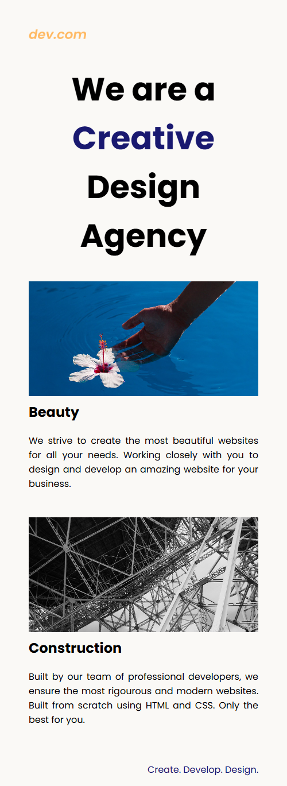
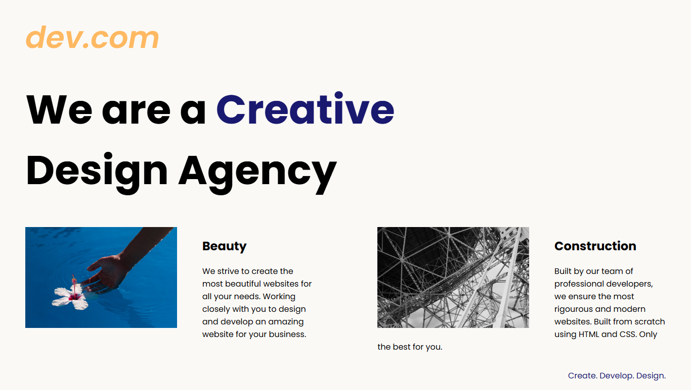

# Creative Agency Website

## 🚀 Live Demo
[View Live Demo](https://karuppaiya-dev.github.io/design-agency-landing-page/)

A basic responsive landing page for a creative design agency.  
Built using HTML and CSS with a simple two-column layout on desktop and mobile-friendly design using media queries.

## Features
- Clean and minimal design
- Desktop and mobile responsive layout
- Simple HTML and CSS structure

## 📷 Preview

  
  

## Technologies Used
- HTML5
- CSS3 (Media Queries)

## How to View
Open the `index.html` file in any browser.

